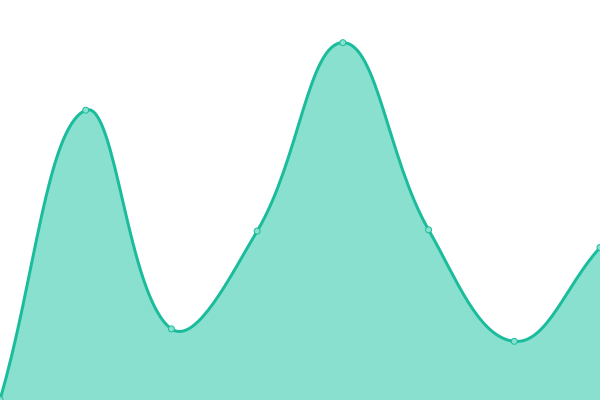

# [📈 Live Status](https://uptime.midlands.media): <!--live status--> **🟧 Partial outage**

This repository contains the open-source uptime monitor and status page for [west-midlands-media-group](https://uptime.midlands.media), powered by [Upptime](https://github.com/upptime/upptime).

With [Upptime](https://upptime.js.org), you can get your own unlimited and free uptime monitor and status page, powered entirely by a GitHub repository. We use [Issues](https://github.com/west-midlands-media-group/upptime/issues) as incident reports, [Actions](https://github.com/west-midlands-media-group/upptime/actions) as uptime monitors, and [Pages](https://uptime.midlands.media) for the status page.

<!--start: status pages-->
<!-- This summary is generated by Upptime (https://github.com/upptime/upptime) -->
<!-- Do not edit this manually, your changes will be overwritten -->
<!-- prettier-ignore -->
| URL | Status | History | Response Time | Uptime |
| --- | ------ | ------- | ------------- | ------ |
|  [WMMG](https://wmmg.uk) | 🟥 Down | [wmmg.yml](https://github.com/West-Midlands-Media-Group/upptime/commits/HEAD/history/wmmg.yml) | 

 322ms
     
 | 

<a href="https://uptime.wmmg.uk/history/wmmg">0.00%</a>
    

|  [Haze](https://hazeband.co.uk) | 🟩 Up | [haze.yml](https://github.com/West-Midlands-Media-Group/upptime/commits/HEAD/history/haze.yml) | 

 2621ms
     
 | 

<a href="https://uptime.wmmg.uk/history/haze">95.18%</a>
    

|  [Haze App Backend](https://app.hazeband.co.uk) | 🟩 Up | [haze-app-backend.yml](https://github.com/West-Midlands-Media-Group/upptime/commits/HEAD/history/haze-app-backend.yml) | 

 1948ms
     
 | 

<a href="https://uptime.wmmg.uk/history/haze-app-backend">97.10%</a>
    

<!--end: status pages-->

[**Visit our status website →**](https://uptime.midlands.media)

## 📄 License

- Powered by: [Upptime](https://github.com/upptime/upptime)
- Code: [MIT](./LICENSE) © [west-midlands-media-group](https://uptime.midlands.media)
- Data in the `./history` directory: [Open Database License](https://opendatacommons.org/licenses/odbl/1-0/)
